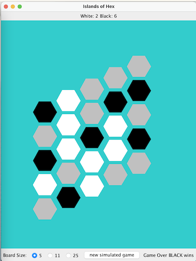

# Islands Of Hex

Islands of Hex is a strategic two-player game where each player aims to control the most islands on a hexagonal game board. One player uses white game pieces, while the other uses black. The game ends when a player creates a continuous chain of game pieces across the board: black from left to right, or white from top to bottom.

## Gameplay

### Objective
- **Win Condition**: The game concludes when one player connects their pieces from one side of the board to the other.
  - Black: Left to Right
  - White: Top to Bottom
- **Islands**: An island is a connected group of same-colored game pieces surrounded by empty tiles or tiles of the opposite color. The player with the most islands at the end of the game wins.

In the example below, there are 2 white islands and 6 black islands. White has formed a path from the top to the bottom,thus winning the game.

## Features

### Backend Functionality
The backend logic for this game includes the following functionalities:

- **Play Validation**: Determine if a move to a specific row and column is valid.
- **Piece Placement**: Place a piece on the board and check if the game is over.
- **Score Calculation**: Compute the score for both white and black players.
- **Game Over Condition**: Determine if the game has ended

### Game Modes
The game can be played between two human players or simulated between two non-intelligent computer players

There are 3 different game play scenarios
* **Quick Play**: 5x5 board
* **Traditional Play**: 11x11 board
* **Big Game**: 25x25 board
* **Stress Test**: 2500x2500 board (for algorithm efficiency testing)
